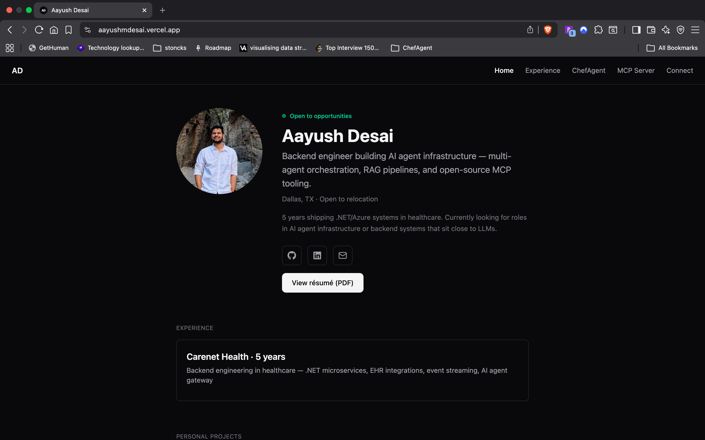

# aayushmdesai.vercel.app

Personal portfolio site — single-page, scrollable, built with React + Tailwind + Vite.



**Live:** [aayushmdesai.vercel.app](https://aayushmdesai.vercel.app)

---

## Sections

- **Home** — intro, experience + project cards, tech stack grid
- **Experience** — Carenet Health (5 years): expanded narratives on key projects with problem → approach → outcome framing
- **ChefAgent** — multi-agent cooking assistant: interactive architecture diagram, animated request lifecycle, eval results, guardrails
- **MCP Server** — mcp-dotnet-diagnostics: demo GIF, 7-tool reference table, install instructions
- **Connect** — contact links

## Stack

- React + Vite + Tailwind v4
- React Icons (`react-icons/fa`) for brand icons
- Lucide React for UI icons
- Deployed on Vercel (auto-deploy from `main`)

## Run locally

```bash
npm install
npm run dev
```

## Notes

- No router — single-page with anchor-based navigation and `IntersectionObserver` for active nav highlighting
- Architecture diagram in ChefAgent is custom SVG with hover-to-reveal and animated request lifecycle linked to node highlighting
- Sticky nav collapses to a hamburger menu on mobile